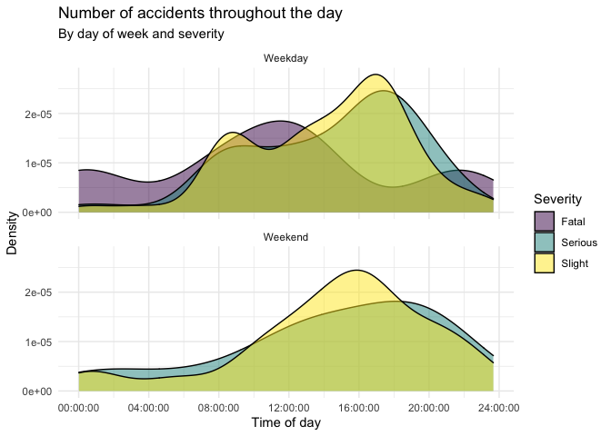
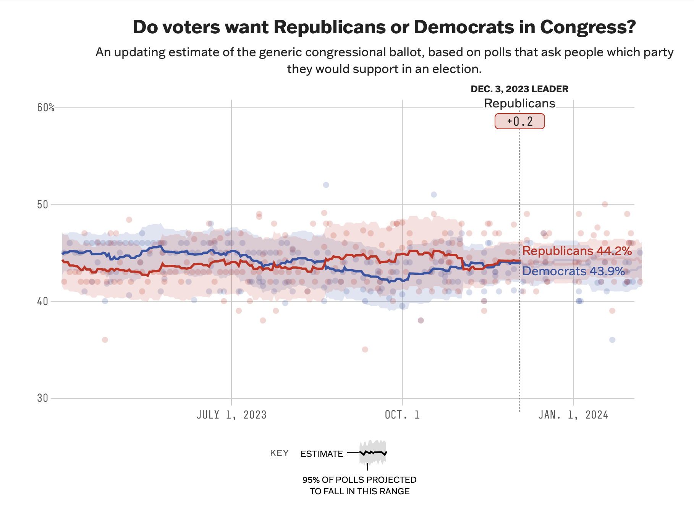

```{r setup, include=FALSE}
# Do not modify this chunk.
knitr::opts_chunk$set(echo = TRUE, warning = FALSE, message = FALSE)
```

```{r}
# Put all necessary libraries here
# I got you started!
# The first time you want to install the dsbox package; then you can comment it out.
# If you have not installed the devtools package, you will need to do so first
# install.packages("devtools")
# library(devtools)

devtools::install_github("tidyverse/dsbox")
library(dsbox)
library(tidyverse)
library(viridis)
```

## Due: Thursday, February 8th at 8:30am

## I worked with Elliott Chang on this assignment
## Goals of this lab

1.  Practice coding to adhere to the Tidyverse Style Guide.
2.  Practice creating and refining graphs with `ggplot2`.
3.  Consider the strengths and weaknesses of various `geom`s and `aes`thetics for telling a data story.

## Notes:

-   When creating your graphs, consider context (i.e. axis labels, title, ...)!
-   If I provide partially completed code, I will put `eval = FALSE` in the chunk. Make sure to change that to `eval = TRUE` once you have completed the code in the chunk.
-   Be prepared to ask for help from me, Simon, and your classmates! We scratched the surface of `ggplot2` in class. But I encourage you to really dig in and make your graphs your own (i.e. don't rely on defaults).

## Problems

### Probem 1: Road traffic injuries in Edinburgh, Scotland

The dataset can be found in the `dsbox` package, and is called `accidents`. It covers all recorded accidents in Edinburgh in 2018; compared to the dataset made available by the UK government, some of the variables were modified for the purposes of the package. You can find out more about the dataset by inspecting its documentation with `?accidents`. Recreate the following plot, and interpret the results.

```{r}
?accidents
```

```{r}
library(dsbox)
library(ggplot2)
library(dplyr)

data("accidents")

accidents$date <- as.Date(accidents$date)

accidents$day_of_week <- weekdays(accidents$date)
accidents$is_weekend <- ifelse(accidents$day_of_week %in% c("Saturday", "Sunday"), "Weekend", "Weekday")

density_plot <- ggplot(accidents, aes(x = time)) +
  geom_density(aes(color = severity, fill = severity), alpha = 0.5) +
  scale_color_manual(values = c("Slight" = "yellow", "Serious" = "cyan", "Fatal" = "purple")) +
  scale_fill_manual(values = c("Slight" = "yellow", "Serious" = "cyan", "Fatal" = "purple")) +
  labs(title = "Number of Accidents throughout the Day",
       subtitle = "by day of week and severity",
       x = "Time",
       y = "Density") +
  theme_minimal() +
  facet_grid(is_weekend ~ ., scales = "free_y")

# Display the plot
print(density_plot)

```

```{r, out.width="100%", echo=FALSE}

```

### Problem 2: One Dataset, Visualized ~~25~~ 5 Ways

Inspired by Nathan Yau's [One Dataset, Visualized 25 Ways](https://flowingdata.com/2017/01/24/one-dataset-visualized-25-ways/), I want you to create 5 visualizations of the same data. You can use the `mpg` dataset or another dataset of your choosing, including the `accidents` dataset above. Make sure you have the data manual open for this problem!


Cameron Adams <cadams@reed.edu>
9:49 PM (0 minutes ago)

to me

a. Pick 3 - 4 variables you want to explore.  Provide their code names here.

```{r}
head(mpg)
```
year, cty, hwy, drv

b. Create 5 graphs.  A few things to consider:
    + Like Nathan's graphs, they don't all have to contain every one of your selected variables.
    + You can't use the same `geom` for all four graphs but you can use the same `geom` more than once.
    + Think carefully about color, the coordinate system, and scales.
    + Feel free to subset or wrangling the dataset if you want to but it isn't required.

```{r}
ggplot(mpg, aes(x = cty, y= hwy, color = cyl)) + 
  geom_point() +
  geom_smooth(method = "lm", se = F)
```

```{r}
ggplot(mpg, aes(x = trans, y = hwy, fill = trans)) +
  geom_boxplot()
```

```{r}
ggplot(mpg, aes(factor(cyl), fill = factor(year))) +
  geom_bar()
```

```{r}
ggplot(mpg, aes(x = cty, y = hwy, color = factor(cyl))) +
  geom_point() +
  facet_wrap(~ factor(drv)) +
  labs(title = "Highway vs City MPG by Drivetrain Type",
       x = "City MPG",
       y = "Highway MPG")

```
```{r}
ggplot(mpg, aes(x = cty, fill = factor(z))) +
  geom_histogram(binwidth = 2, position = "dodge") +
  labs(title = "Distribution of City Mileage by Drivetrain Type",
       x = "City MPG",
       y = "Frequency")

```


c.  Discuss the pros/cons of your graphs. What useful information can be gleaned? How do the different geoms and aesthetics impact the story?


The scatterplot with a linear regression line effectively illustrates the relationship between city and highway mileage, but it can suffer from overcrowding and oversimplified trend representation. The boxplot of highway mileage by transmission type provides clear distribution comparisons but lacks insights into relationships with other variables. The barplot of cylinder count by model year offers straightforward trend depiction but overlooks other variable relationships. Both the scatterplot with facet wrap and histogram by drivetrain type allow for within-category comparisons, but the can also have facet size issues, and the latter doesn't capture additional variable relationships. Each graph's choice of geom and aesthetics impacts the story by emphasizing different data aspects, such as trends, distributions, or group comparisons.

### Problem 3: Style This Code!

Take the following code and don't change its functionality but DO change its style. Use the [Tidyverse Style Guide](https://style.tidyverse.org/)!

```{r}
thing.132232=data.frame(theanimalsweightisthisnumber=c(runif(3),NA),y=c("cat","mouse","dog","rat"))
median(thing.132232$theanimalsweightisthisnumber, TRUE);mean(thing.132232$theanimalsweightisthisnumber, 0 , TRUE); var(thing.132232$theanimalsweightisthisnumber, NULL, TRUE)


ggplot(thing.132232, aes(y=theanimalsweightisthisnumber,x=y))+geom_col()+scale_y_continuous()


```

```{r}

animal_data <- tibble(
  weight = c(runif(3), NA),
  animal = c("cat", "mouse", "dog", "rat") 
)

median_weight <- median(animal_data$weight, na.rm = TRUE)
mean_weight <- mean(animal_data$weight, na.rm = TRUE)
variance_weight <- var(animal_data$weight, na.rm = TRUE)

ggplot(animal_data, aes(x = reorder(animal, weight), y = weight, fill = animal)) +
  geom_col() +
  scale_y_continuous() +
  labs(
    x = "Animal",
    y = "Weight",
    title = "Weight Distribution Across Animals",
    subtitle = "Excluding NA values",
    caption = "Data source: Animal Data Repository"
  ) +
  theme(
    axis.text.x = element_text(angle = 45, hjust = 1)  
  )

```

### Problem 4: Imitation is the Sincerest Form of Flattery

For this problem, I want you to try to recreate a FiveThirtyEight.com graphic. Awesomely, they share their data with the world [here](https://data.fivethirtyeight.com/). (Note: You don't need to recreate all their branding/background color scheme.)

a.  Take a screenshot of the graph, upload it to the same folder on the server where you have saved your lab, and insert the file name below. Then change the `eval = FALSE` to `eval = TRUE`.

```{r, out.width="100%", echo=FALSE, eval = TRUE}
#
```

#

b.  Load the data and recreate the graph as best as you can.\
```{r}
getwd()

```

```{r}
data <- read.csv("../data/generic_ballot_polls.csv")


```

c.  Now make the graph better somehow.

```{r}


data$end_date <- as.Date(data$end_date, format = "%m/%d/%y")

#This is what makes this graoh better
map_alpha <- function(grade) {
  alpha_values <- c(1, 0.9, 0.8, 0.7, 0.6, 0.5, 0.4, 0.3, 0.001)
  grade_order <- c("A", "A/B", "B+", "B", "B-", "B/C", "C+", "C/D", "")
  alpha_values[match(grade, grade_order)]
}

ggplot(data, aes(x = end_date)) +
  geom_point(aes(y = dem / 100, alpha = fte_grade), color = "blue", size = 2) +  
  geom_point(aes(y = rep / 100, alpha = fte_grade), color = "red", size = 2) +  
  geom_smooth(aes(y = dem / 100), color = "blue", method = "loess", se = FALSE) +  
  geom_smooth(aes(y = rep / 100), color = "red", method = "loess", se = FALSE) +  
  labs(title = "Do voters want Republicans or Democrats in Congress?",
       subtitle = "An updating estimate of the generic congressional ballot, based on \n polls that ask people which party they would support in an election",
       x = "Date",
       y = "Percent",
       color = "Party") +
  scale_alpha_manual(values = map_alpha(unique(data$fte_grade))) +  
  scale_y_continuous(labels = scales::percent_format(scale = 1)) +  
  theme_minimal() +
  theme(legend.position = "none")  

```


d.  Justify why your rendition of this `FiveThirtyEight.com` graph is more effective at telling the data story than the original.

While not quite as good as the image, my goal was to have a more continues line that approximated the graph, along with adding in an opacity to the data points which corresponded to the grade of the survey and how reliable it is.

### Problem 5: Rental apartments in SF

The data for this exercise comes from `TidyTuesday`, and is on rental prices in San Francisco. You can find out more about the dataset by inspecting its documentation [here](https://github.com/rfordatascience/tidytuesday/tree/master/data/2022/2022-07-05). The dataset you'll be using is called `rent`. Create a visualization that will help you compare the distribution of rental prices (`price`) per bedroom (`beds`) across neighborhoods (`nhood`) in the city of San Francisco `(city == "san francisco")`, over time.

Limit your analysis to rentals where the full unit is available, i.e. (`room_in_apt == 0`). You have the flexibility to choose which years and which neighborhoods. Note that you should have a maximum of 8 neighborhoods on your visualization, but one or more of them can be a combination of many (e.g., an "other" category). Your visualization should also display some measure of the variability in your data. You get to decide what type of visualization to create and there is more than one correct answer! In your answer, include a brief description of why you made the choices you made as well as an interpretation of the findings of how rental prices vary over time and neighborhoods in San Francisco.

```{r, eval = F}
# Get the Data

# Read in with tidytuesdayR package 
# Install from CRAN via: install.packages("tidytuesdayR")
# This loads the readme and all the datasets for the week of interest

library(tidytuesdayR)
tuesdata <- tidytuesdayR::tt_load('2022-07-05') # this could take a minute

rent <- tuesdata$rent

```

```{r}
library(tidyverse)
library(tidytuesdayR)

tuesdata <- tidytuesdayR::tt_load('2022-07-05')
rent <- tuesdata$rent

rent_sf <- rent %>%
  filter(city == "san francisco", room_in_apt == 0)

rent_sf <- rent_sf %>%
  select(year, nhood, beds, price)

top_neighborhoods <- rent_sf %>%
  group_by(nhood) %>%
  summarize(avg_price = mean(price)) %>%
  top_n(8, wt = avg_price) %>%
  pull(nhood)

rent_sf <- rent_sf %>%
  filter(nhood %in% top_neighborhoods)

ggplot(rent_sf, aes(x = factor(year), y = price / beds, fill = nhood)) +
  geom_boxplot() +
  scale_fill_brewer(palette = "Set3") +
  facet_wrap(~ nhood, ncol = 2) +
  labs(title = "Distribution of Rental Prices per Bedroom Across \n Top Neighborhoods in San Francisco",
       x = "Year",
       y = "Price per Bedroom") +
  theme_minimal() +
  theme(axis.text.x = element_text(angle = 75, hjust = 1))

```

